# Streamlining GitOps workflows with MCPs in OpenShift Lightspeed

Picture this: you're an application developer managing workloads in OpenShift and you want to streamline your daily workflow. You need to monitor your workloads' health, detect incidents as they happen, fix them directly in your source of truth (GitHub) and have those changes automatically applied to your cluster through GitOps. All from a single platform, your OpenShift cluster, without jumping between tools.

That's exactly what I set out to build and what I will show you in this article. By connecting the GitHub MCP Server and the Incident Detection MCP Server to OpenShift Lightspeed, I created a workflow where I can check my workloads' health, identify issues, push fixes to my repo, and let GitOps handle the rest, all powered by AI.

To give you some context, I'm working with an OpenShift 4.21 cluster where I have OpenShift Lightspeed up and running, connected to an LLM (gpt-4). I also have GitOps set up to deploy my workloads straight from my [GitHub repo](https://github.com/dialvare/ols-git-mcp), so whenever I push a change, it gets applied automatically.

With that foundation in place and my sample app already deployed in the cluster, I'm ready to start exploring how to bring MCPs into the mix.

## Incident Detection MCP Server

You know the pain of alert storms: dozens of alerts firing at once, and you're left trying to figure out which ones actually matter and what's the root cause. That's exactly the problem that the Incident Detection feature in the Cluster Observability Operator solves. It groups related alerts into incidents, shows them on a timeline color-coded by severity, and categorizes them by affected component. Instead of drowning in noise, you get a clear picture of what's happening. 

Now, the interesting part: there's an MCP server that exposes this functionality. Below you can find the steps I had to follow to install the Cluster Observability Operator, enable the Incidents feature and deploy the MCP server:

1. Install Red Hat OpenShift [Cluster Observability Operator](https://docs.redhat.com/en/documentation/red_hat_openshift_cluster_observability_operator/1-latest/html/installing_red_hat_openshift_cluster_observability_operator/installing-the-cluster-observability-operator#installing-the-cluster-observability-operator-in-the-web-console-_installing_the_cluster_observability_operator).
2. Install the [Monitoring UI plugin](https://docs.redhat.com/en/documentation/red_hat_openshift_cluster_observability_operator/1-latest/html/ui_plugins_for_red_hat_openshift_cluster_observability_operator/monitoring-ui-plugin#coo-monitoring-ui-plugin-install_monitoring-ui-plugin).
3. Deploy the Incident Detection MCP server directly into the OpenShift cluster:

    ```bash
    oc apply -f https://raw.githubusercontent.com/openshift/cluster-health-analyzer/refs/heads/mcp-dev-preview/manifests/mcp/01_service_account.yaml
    ```
    ```bash
    oc apply -f https://raw.githubusercontent.com/openshift/cluster-health-analyzer/refs/heads/mcp-dev-preview/manifests/mcp/02_deployment.yaml
    ```
    ```bash
    oc apply -f https://raw.githubusercontent.com/openshift/cluster-health-analyzer/refs/heads/mcp-dev-preview/manifests/mcp/03_mcp_service.yaml
    ```

4. A new Incidents dashboard becomes available in the OpenShift cluster under *Observe* > *Alerting* > *Incidents*

For a more detailed explanation on how to configure the full stack, please check [this blog](https://developers.redhat.com/articles/2025/04/15/incident-detection-openshift-tech-preview-here#why_you_need_incident_detection_).

## GitHub MCP Server

Now that the Incident Detection MCP server is deployed, it's time to start with the second component: the [Remote GitHub MCP Server](https://github.com/github/github-mcp-server/blob/main/docs/remote-server.md). This MCP server will provide different toolsets to manage GitHub workflows remotely, meaning that there's no need to host the server either locally or in the cluster. However, in order to connect to the remote server authentication is required. Here's the configuration needed:

1. In GitHub, navigate to [Personal Access Token (PAT) settings](https://github.com/settings/personal-access-tokens). There, create your PAT classic token.
2. In the cluster, this PAT needs to be securely stored as a secret, so it can be used later to connect the MCP to the OpenShift Lightspeed instance:

    ```bash
    oc create secret generic github-mcp-token --from-literal=header="Bearer <your-gh-token>" -n openshift-lightspeed
    ```

## OpenShift Lightspeed configuration

Now that both MCP servers are ready (the Incident Detection MCP deployed in-cluster and the GitHub MCP accessible remotely), the final step is connecting them to OpenShift Lightspeed. Luckily the [custom MCP server configuration](https://docs.redhat.com/en/documentation/red_hat_openshift_lightspeed/1.0/html/configure/ols-configuring-openshift-lightspeed#ols-enabling-mcp-server_ols-configuring-openshift-lightspeed) in quite simple and straightforward. I only had to add the following lines to my OLSConfig custom resource and in a matter of seconds, the operator was ready again, but this time with extended abilities thanks to the two new MCP servers. Here you can find the lines I added: 

```yaml
...
spec:
  featureGates:
    - MCPServer
  mcpServers:
    - headers:
        - name: Authorization
          valueFrom:
            secretRef:
              name: github-mcp-token
            type: secret
      name: github-mcp-server
      timeout: 30
      url: 'https://api.githubcopilot.com/mcp/'
    - headers:
        - name: kubernetes-authorization
          valueFrom:
            type: kubernetes
      name: cluster-health
      timeout: 30
      url: 'http://cluster-health-mcp-server.openshift-cluster-observability-operator.svc.cluster.local:8085/mcp'
  ols:
    introspectionEnabled: true
...
```

As you can see above, I only had to add two new stanzas. First, the `featureGates.MCPServer` to enable bringing custom MCPs into the AI assistant, and second the list of MCPs to include. Under each `mcpServers` item, the configuration requires specifying the *name*, *url*, and the *authorization header* that can be either the kubernetes one or a secret containing the header token. 

Additionally I have enabled the [built-in MCP server](https://docs.redhat.com/en/documentation/red_hat_openshift_lightspeed/1.0/html/configure/ols-configuring-openshift-lightspeed#about-cluster-interaction_ols-configuring-openshift-lightspeed) OpenShift Lightspeed provides by enabling the `introspectionEnabled: true` feature. This will allow the AI assistant to extract information from Kubernetes resources from the cluster. 

## Walking through a real incident

With all the components configured and running in just ~5 minutes, it's time to see the real value. Let me walk you through a practical scenario where OpenShift Lightspeed, powered by these three MCP servers, helps me identify, troubleshoot, and fix a production incident, all through natural language conversation. 

Everything starts with a simple question in OpenShift Lightspeed: **"Are there any active incidents in my cluster?"**

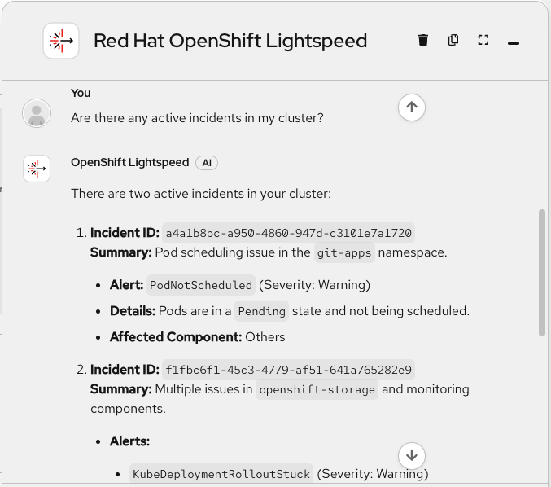

Uh-oh! There's a problem with one of my workloads. But wait, how can OpenShift Lightspeed understand what's happening? Where is this information coming from? Of course, the Incidents MCP server:


Here I can see that the *get_incidents* tool was invoked and collected the information. OpenShift Lightspeed even provides me a link to see the Incident that is firing. Let's see it in the Web Console:

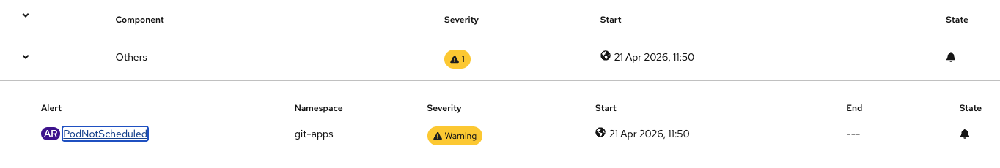

There it is. The Alerting Rule I configured to detect issues in my *git-apps* namespace has been triggered. Time to troubleshoot the issue... I'll start by identifying the failing pod by asking **"Which pods are not running in the git-apps namespace?"**

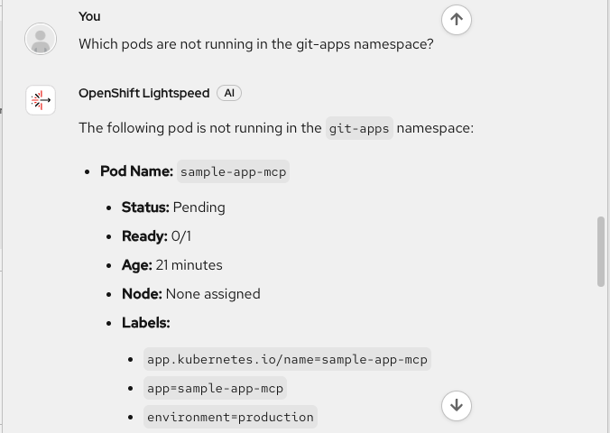

Okay, there's something missconfigured in the *sample-app-mcp* application. It's still Pending and couldn't be assigned to any nodes. I'll check what's wrong in the Web Console and keep digging into the issue. 

Next, I'll attach the full YAML pod configuration and enable the new *Troubleshooting* mode. Now, let's let OpenShift Lightspeed figure out what's happening: **"What’s wrong with this pod?"**

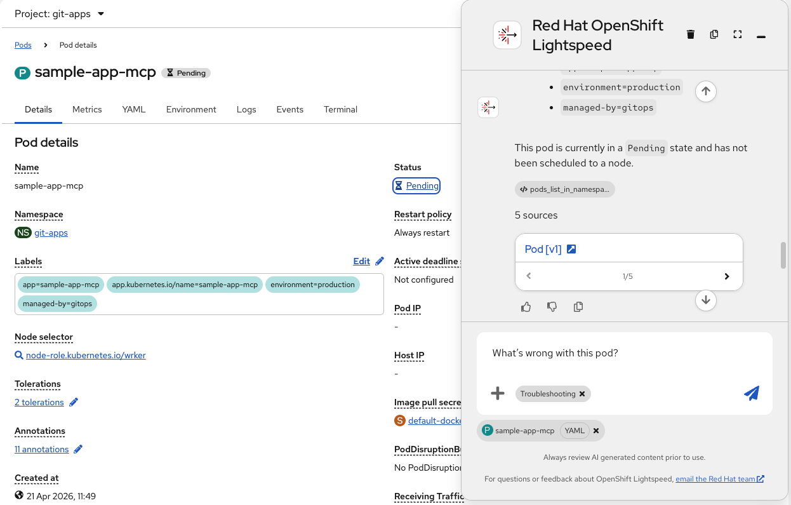

In just a few seconds OpenShift Lightspeed analizes the YAML configuration and provides a response: 

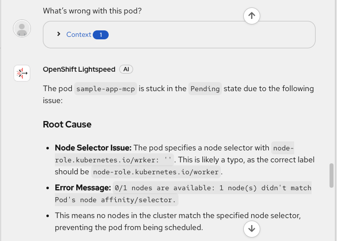

Typical mistake! Somebody introduced a typo in the YAML configuration. The nodeSelector is not correct and cannot be scheduled. In the same answer OpenShift Lightspeed provides the root cause and the fix. 

Now, let's see what's the current structure in my source-of-truth repository to see where the fix should be placed. Without leaving my cluster, I can ask **"Can you  now analyze the Git structure and contents? Use the pod annotations to find the repo info"**

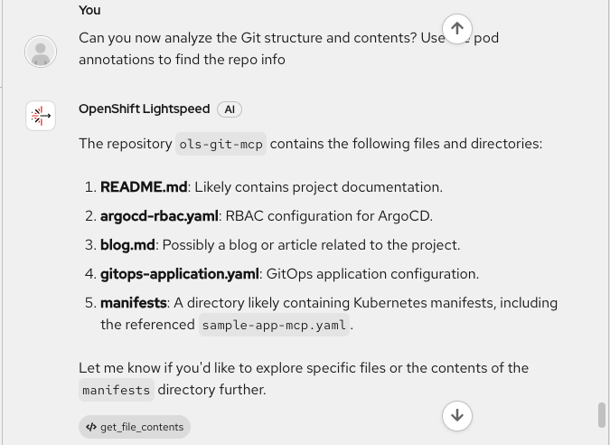

How was OpenShift Lightspeed able to know what's the GitHub repo? Really simple. I have added that information as annotations inside the pod YAML (repo URL, path, branch, etc).

Now I have a detailed explanation of all the components, and this is where the GitHub MCP server enters the scene for the first time. OpenShift Lightspeed invoked the *get_file_contents* tool to fetch the repo information. 

With the root cause identified and the repository structure understood, it's time to apply the fix. I don't want to break anything, especially in production clusters, so a safe approach will be creating a new branch where the correct pod configuration will be added. All this with a simple query: **"Open a new branch and add the fix to the nodeSelector"**

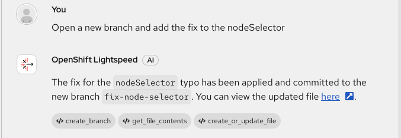

The power of MCPs unchained! Three MCP tools in action to help me with my question: *create_branch*, *get_file_contents* and *create_or_update_file*. The names are quite descriptive on what each of them do, but before merging it, I'll act as human in the loop and verify the changes with **"Show me the updated file"**

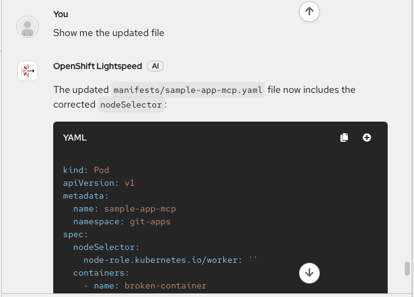

Perfect! My app manifest now contains the fixed nodeSelector. It's safe to open a new pull request. I'll indicate the name of the PR and let the powerful LLM generate the description: **"Now, open a pull request titled 'Fix nodeSelector typo preventing pod scheduling'"**

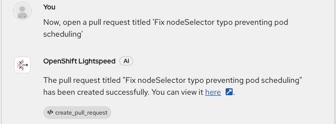

The response contains a link to the PR, but one of the advantages of MCP servers is being able to connect and manage different systems from a single place: my OpenShift cluster, so I prefer to check the PR from here: **"Show me the details of the latest PR"**

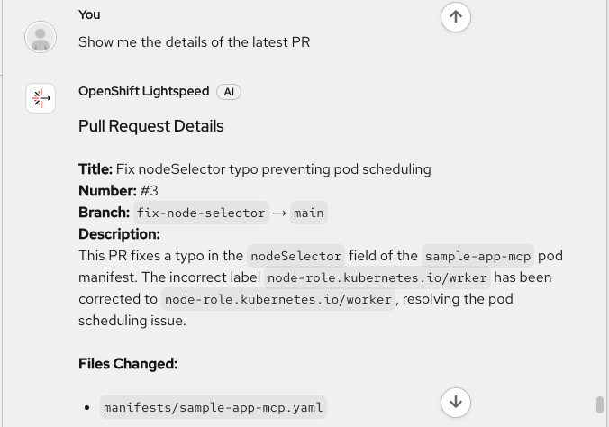

A really accurate description. Everything is looking good: the title, the current and destination branches, the description and of course, the correct app nodeSelector. Ready to apply the fix: **"Please merge the PR #3"**

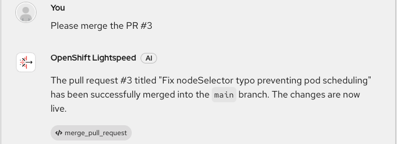

With a simple query in natural language I have changed the configuration of my application. Easily, secure and fast, all my OpenShift clusters are now applying the fix automatically thanks to the GitOps magic! Finally, let's verify the app is correctly running by asking **"Is the pod running now?"** 

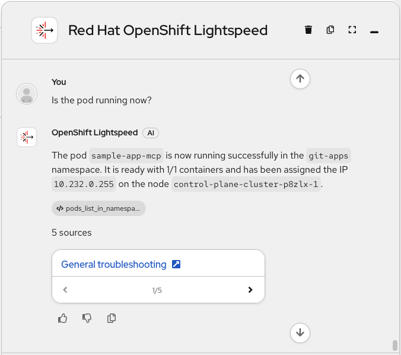

Excellent! The application has been scheduled in the worker node and now it's running. The incident I detected a few minutes ago has been easily resolved, with assisted guidance, following all best practices and standards, and without leaving my cluster, where my workloads live. 

## Final Thoughts

In this blogpost, I built a workflow that traditionally requires jumping between the OpenShift Console, GitHub UI, Prometheus dashboards, and oc commands. By connecting the Incident Detection and GitHub MCP servers to OpenShift Lightspeed, and combined with the built-in introspection MCP server, I made use of a unified OpenShift Lightspeed interface that handles the entire incident lifecycle through natural language conversation—from detection to deployment.

MCP servers transform OpenShift Lightspeed from an AI assistant into an intelligent orchestrator. The GitHub MCP provides source control management, the Incident Detection MCP delivers observability insights, and the built-in MCP enables cluster introspection. Together, they turn simple questions into sophisticated multi-system workflows, fundamentally changing how developers interact with their infrastructure.